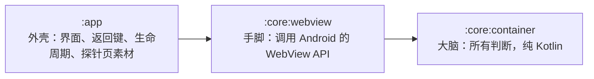

# 导读 · 第一次读这个仓

代码里的注释写的是「为什么这样写」，默认你已经知道 WebView、origin、探针页这些东西。这份导读补的是
另一半：**它们是什么、放在哪、一次启动时怎么串起来**。读完再去看代码，注释就读得懂了。

## 一句话

一个 Android App，里面只有一个 `WebView`（嵌在 App 里的浏览器），加载一个**打包在 APK 里的测试网页**
（探针页），并替这个网页把关：能跳到哪、能用什么权限、加载失败了显示什么。

它不是产品，是「容器」这层壳子本身。探针页会自己检查十六条规矩成不成立，把结果打到日志里。

## 先认识这些词

| 词 | 在这个仓里指什么 |
| --- | --- |
| WebView | Android 自带的浏览器控件，内核就是 Chrome。本仓只用一个 |
| 容器 / 宿主 | 容器是装网页的这层（`CrabContainer`）；宿主是装容器的 App（`MainActivity`） |
| origin | 「协议 + 域名 + 端口」三件套，浏览器按它划安全边界。本仓的**承载 origin** 是 `https://and.crab.invalid`，只定义在 `HostingOrigin.kt` 一处 |
| `.invalid` | 国际标准里保留的域名后缀，永远解析不到。用它当域名，就算有请求漏出去也打不到真服务器 |
| assets | 打包进 APK 的原始文件，在 `app/src/main/assets/`。探针页就放在 `assets/probe/` |
| 拦截 | WebView 每发一个请求，都会先问一次 `shouldInterceptRequest`。本仓在这里把请求换成 assets 里的文件，所以网页以为自己在访问 `https://and.crab.invalid/...`，其实读的是本地文件 |
| 注入 | 在网页自己的脚本运行**之前**，先放进去一小段 JS（设置 `window.__CRAB__`）。有两条路：新内核用 `addDocumentStartJavaScript`，旧内核退到「拦截时改写 HTML」，两条只能走一条 |
| UA | User-Agent，浏览器自报身份的那串字。本仓在系统原值后面追加 `Crab/0.1.0` |
| 渲染进程 | WebView 跑网页的那个独立进程。它可能崩，崩了容器要换一个新 WebView |
| 探针页 | `assets/probe/index.html` + `probe.js`，一个会自己检查容器的测试网页 |
| slug | 每条检查的短名字，如 `origin`、`nav-back`。十六个，定义在 `ProbeContract.SLUGS` |
| logcat | Android 的系统日志，电脑上用 `adb logcat` 看。容器的关键行为都打成 `CRAB-NAV` / `CRAB-DLG` / `CRAB-PERM` / `CRAB-ERR` 开头的一行 |
| stub / 假绿 | 在电脑上跑单测时，`android.webkit` 里的类只是空壳（stub），调用它们什么都不做。对它写断言，测试会「绿」，但那个绿和代码对不对无关 |
| pro / M1–M5 | pro 是上游的规划仓（`~/Desktop/github/Prospect`），规定容器要做什么、怎么算做完。M1–M5 是它定的五个里程碑：装到模拟器、本地承载、配置注入与 UA、导航与降级、调试开关与收口 |
| convention plugin | `build-logic/` 里的 Gradle 插件，把 Android 的公共构建配置写在一处，各模块套上即可 |

## 三个模块：大脑、手脚、外壳



- **`:core:container` 是大脑**：只做决定，不碰任何 Android API。「这个链接能不能跳」「这个路径能不能读」
  「现在该显示错误页吗」全在这里
- **`:core:webview` 是手脚**：接住 WebView 的回调，原样问大脑，再把大脑的答案原样交回去。**这里不许有
  `if` 判断**
- **`:app` 是外壳**：把容器放到屏幕上，处理返回键、切后台、错误界面

**为什么这样切？** 因为上面说的「假绿」。判断逻辑只要写在碰 Android API 的地方，就没法在电脑上真测。
所以所有判断都挪进纯 Kotlin 的 `:core:container`，那里的单测是真的；`:core:webview` 只剩几行搬运，
错不了多少。详细理由见 [ADR 0002](adr/0002-按可测性切三模块.md)。

## 跟着一次启动走一遍

App 从点开图标到页面出结果，按顺序经过这些地方：

1. **`CrabApplication.onCreate`**：进程一起来就按构建类型开关远程调试
   （`RemoteDebugging.enabledFor(BuildConfig.DEBUG)`）
2. **`MainActivity.onCreate`**：造一个 `CrabContainer`，挂上返回键回调，调 `loadEntry()`，再用 Compose 的
   `AndroidView` 把 WebView 放到屏幕上
3. **`CrabContainer` 构造时**做四件事：
   - 问内核支不支持原生注入（`documentStartScriptSupported`）
   - 建 `WebViewAssetLoader`：域名取 `HostingOrigin.DOMAIN`，所有路径都交给 `CrabAssetPathHandler`
   - 建 `ContainerCoordinator`（大脑的总入口）
   - `createWebView()`：`applyCrabSpec` 把 `WebSettingsSpec` 的取值写进 WebView，装上两个 client；
     支持原生注入就调 `addDocumentStartJavaScript`
4. **`loadEntry()`** 加载 `https://and.crab.invalid/probe/index.html`
5. **WebView 去要这个地址**：
   `CrabWebViewClient.shouldInterceptRequest` → `WebViewAssetLoader` → `CrabAssetPathHandler.handle`
   → **`AssetRouting.resolve`**（大脑判：在承载目录里吗？有没有 `../` 想跑出去？）
   → 命中就从 assets 读出文件回 200，否则回 404 + 文字 `INTERCEPTED`
6. **页面开始跑**：注入脚本先跑（`DocumentStartScript.source`），`index.html` 记下快照，然后 `probe.js`
   逐条检查。每条结果 `console.log('CRAB-PROBE <slug> PASS|FAIL')`
7. **`CrabWebChromeClient.onConsoleMessage`** 把这些 console 行转进 logcat（只在 debug 包里转），
   `scripts/probe.sh` 再从 logcat 里捞出来，打成固定的十六行
8. 同时 `onPageStarted` / `onPageFinished` → `ContainerCoordinator` → `ContainerStateMachine`，
   状态从 `Loading` 变成 `Content`

## 八种事件各走哪条路

规律都一样：**`:core:webview` 的回调接住 → `ContainerCoordinator` 判 → 回调把答案交还 WebView**。

| 发生了什么 | 回调（手脚） | 判断（大脑） | 结果 |
| --- | --- | --- | --- |
| 点了跨 origin 的链接 | `shouldOverrideUrlLoading` | `NavigationGate.decide` → `Deny` | 不跳，打一行 `CRAB-NAV nav-cross-origin` |
| 点了 `tel:` / `mailto:` | 同上 | → `HandOffToSystem` | 交给拨号盘 / 邮件 |
| `_blank` / `window.open` | `onCreateWindow` | `onWindowOpenRequest` | 不开窗，打 `CRAB-NAV nav-blank` |
| 请求一个不存在的文件 | `shouldInterceptRequest` | `AssetRouting.resolve` → `NotFound` | 回 404 + `INTERCEPTED` |
| 入口页本身 404 | `onReceivedHttpError` | `ContainerStateMachine.onLoadError` | 进错误态，打 `CRAB-ERR load 404`，屏幕显示「页面没能打开」 |
| 渲染进程崩了 | `onRenderProcessGone`（必须返回 true） | `RenderProcessRecovery` | 第一次换新 WebView，第二次进错误态 |
| 网页弹 `alert` / `confirm` / `prompt` | `onJsAlert` 等三个 | `onDialog` 只打日志 | 弹原生对话框，关掉时一定回一次答案 |
| 网页要定位 / 相机 | `onGeolocationPermissionsShowPrompt` / `onPermissionRequest` | `onPermissionRequest` 只打日志 | 一律拒绝，打 `CRAB-PERM` |

返回键和切后台不经过大脑：`MainActivity` 的 `backCallback` 能后退就后退，退到底交还系统；`onPause` /
`onResume` 转给 `CrabContainer` 暂停、恢复 WebView。

## 每个文件一句话

**`:core:container`（大脑，都有单测，测试在 `src/test/` 下同名 `...Test.kt`）**

| 文件 | 干什么 |
| --- | --- |
| `HostingOrigin.kt` | 承载 origin 的唯一定义，外加「这个 URL 是不是自己人」的判断 |
| `AssetRouting.kt` | URL 路径 → assets 文件路径，挡住 `../` 与各种编码后的穿越 |
| `NavigationGate.kt` | 导航闸门：放行、拒绝、还是交给系统 |
| `ContainerCoordinator.kt` | 大脑的总入口，所有回调都先到这里；`ContainerActions` 接口规定它能叫手脚做的五件事 |
| `ContainerState.kt` | 三个状态（加载中 / 内容 / 错误）和状态怎么切换 |
| `RenderProcessRecovery.kt` | 渲染进程崩了能自动恢复几次（一次） |
| `CrabLog.kt` | 四种 `CRAB-*` 日志行的拼法 |
| `DocumentStartScript.kt` | 注入的那段 JS，以及兜底时怎么插进 HTML |
| `WebSettingsSpec.kt` | WebView 各项配置的取值，每项都写了为什么 |
| `UserAgent.kt` | UA 后面追加 `Crab/版本号` |
| `RemoteDebugging.kt` | 远程调试开不开（只看是不是 debug 包） |
| `ProbeContract.kt` | 探针页与脚本共用的约定：十六个 slug、固定标记、四个越界地址 |

**`:core:webview`（手脚，刻意没有单测）**

| 文件 | 干什么 |
| --- | --- |
| `CrabContainer.kt` | 造 WebView、装配置、装拦截与注入、加载入口页、崩了换新的 |
| `CrabWebSettings.kt` | 把 `WebSettingsSpec` 逐项写进 `WebSettings` |
| `CrabAssetPathHandler.kt` | 拦截点：问 `AssetRouting`，读文件或回 404 |
| `CrabWebViewClient.kt` | 页面加载、导航、错误、SSL、渲染进程这几类回调的转发 |
| `CrabWebChromeClient.kt` | console、开新窗口、三种对话框、权限这几类回调的转发 |

**`:app`（外壳）**

| 文件 | 干什么 |
| --- | --- |
| `CrabApplication.kt` | 开关远程调试 |
| `MainActivity.kt` | 放容器、错误界面、返回键、生命周期 |
| `assets/probe/` | 探针页：`index.html`、`probe.js`、`second.html`（第二页）、`probe.png`、`tone.wav` |
| `assets/outside/out-of-bounds.txt` | 承载目录**之外**的文件，页面要是读到它就说明穿越成功了 |
| `src/test/.../probe/` | 三个扫源码的测试：origin 只定义一处、探针页与 Kotlin 约定逐字对齐、调试开关取构建类型 |

**构建与脚本**

| 文件 | 干什么 |
| --- | --- |
| `settings.gradle.kts` | 注册三个模块、声明仓库 |
| `gradle/libs.versions.toml` | 所有版本号只写在这里 |
| `build-logic/` | 四个 convention plugin：Android 应用、Android 库、Compose、纯 JVM 库 |
| `scripts/check.sh` | 格式 → 构建 → 单测 → lint，本机能跑的全部检查 |
| `scripts/probe.sh` | 在模拟器上装、启动、等你手动点完、从 logcat 回读十六行 |
| `scripts/env-probe.sh` | 看本机环境缺什么 |

## 建议的阅读顺序

每读一个大脑里的类，**同时打开它的测试**。测试名是中文，一条测试就是一句需求，比注释好懂。

1. `HostingOrigin.kt` + `HostingOriginTest.kt`：最小的一块，先看懂「origin」是什么
2. `NavigationGate.kt` + `NavigationGateTest.kt`：看一个判断怎么变成几种结论
3. `AssetRouting.kt` + `AssetRoutingTest.kt`：看为什么路径要解码好几轮
4. `ContainerState.kt` → `ContainerCoordinator.kt` + `ContainerCoordinatorTest.kt`：看大脑怎么指挥手脚；
   测试开头那个 `RecordingActions` 就是「手写 fake」，它假装是手脚，把大脑叫它做的事记下来
5. `CrabWebViewClient.kt`、`CrabWebChromeClient.kt`：确认它们真的只是转发
6. `CrabContainer.kt`、`MainActivity.kt`：把上面这些装起来
7. `assets/probe/index.html` + `probe.js`：从网页那一侧看同一件事
8. 最后才看构建：`settings.gradle.kts` → `libs.versions.toml` → `build-logic/`

## 动手试一试（不需要模拟器）

先在终端里准备好 Java（`check.sh` 会自己设，直接调 `./gradlew` 时要手动设）：

```bash
export JAVA_HOME="/Applications/Android Studio.app/Contents/jbr/Contents/Home"
```

**跑全部检查：**

```bash
./scripts/check.sh
```

**只跑一个类的测试**（大脑模块是纯 JVM，任务名就是 `test`）：

```bash
./gradlew :core:container:test --tests '*NavigationGateTest'
```

测试报告在 `core/container/build/reports/tests/test/index.html`，用浏览器打开能看到每条测试。

**故意改坏一处，看哪条测试抓住它**，这是最快理解「每条测试在守什么」的办法：

- 把 `NavigationGate.kt` 里 `SYSTEM_SCHEMES` 的 `"mailto"` 删掉，再跑上面那条命令
- 在 `MainActivity.kt` 里随便加一行 `val x = "and.crab.invalid"`，跑 `./gradlew :app:testDebugUnitTest`，
  `HostingOriginSingleDefinitionTest` 会红（它扫的是各模块的 `src/main` 与 `scripts/`，测试目录不算）
- 把 `CrabLog.kt` 里 `PREFIX_NAV` 改成 `"CRAB-NAV:"`，跑 `./gradlew :core:container:test`

每次看完用 `git restore .` 还原。

## 其它文档各管什么

| 文档 | 什么时候看 |
| --- | --- |
| [`README.md`](../README.md) | 项目范围与两条验证命令 |
| [`CLAUDE.md`](../CLAUDE.md) | 这个仓的全部规矩（写给 AI 的，但人读也一样） |
| [`TASKS.md`](../TASKS.md) | 每条要求做到哪了、在模拟器上验没验过 |
| [`RUNBOOK.md`](RUNBOOK.md) | 在模拟器上手动验证的步骤 |
| [`PITFALLS.md`](PITFALLS.md) | 构建和环境踩过的坑 |
| [`adr/`](adr/) | 五个已经定下的架构决策，想改结构之前先读 |
| [`待回流-pro.md`](待回流-pro.md) | 发现的 Android 平台事实，等着交回上游 pro |
